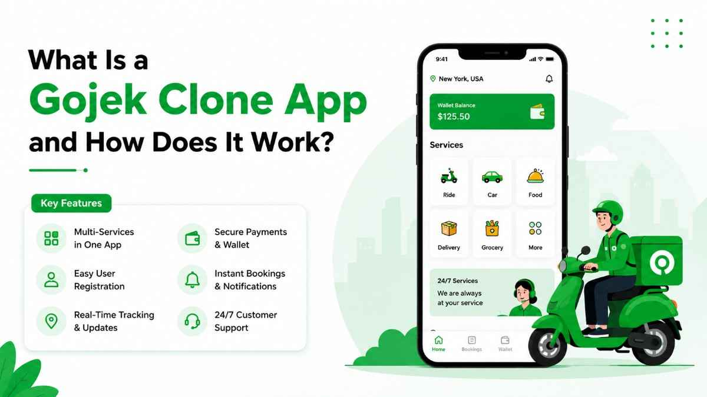

In recent years, the rise of on-demand services has transformed the way consumers access various products and services, leading to the emergence of multi-service platforms. One notable example is the Gojek clone app, which replicates the successful model of the original Gojek platform. This innovative app offers a wide range of services, from transportation and delivery to payments and lifestyle solutions, all within a single interface.&nbsp;

As entrepreneurs and businesses seek to capitalize on the growing demand for such comprehensive solutions, understanding what a Gojek clone app is and how it operates becomes essential. This article explores the intricacies of <a href="https://gojekclone.net/"><strong>Gojek clone apps</strong></a>, highlighting their key features, benefits, development process, and future potential in the ever-evolving digital landscape.

<h2><strong>Understanding Gojek Clone Apps</strong></h2>
<h3><strong>What is a Gojek Clone App?</strong></h3>

A Gojek Clone App is essentially a digital Swiss Army knife, combining multiple on-demand services into a single platform. Inspired by the original Gojek, which started as a motorcycle ride-hailing service in Indonesia, these clone apps offer everything from ride-sharing and food delivery to digital payments and handyman services. It&rsquo;s the &ldquo;one app to rule them all&rdquo; for users seeking convenience and efficiency in their busy lives.

<h3><strong>Origin and Evolution of Gojek</strong></h3>

Gojek burst onto the scene in 2010, transforming the way Indonesians zipped around town. What began as a ride-hailing app quickly morphed into a multi-service platform, adding features like food delivery, grocery shopping, and even massages (because who doesn&rsquo;t want to get pampered after a long day?). Its success inspired a wave of similar apps across Southeast Asia and beyond, giving birth to the Gojek Clone phenomenon. It&rsquo;s like the &ldquo;copycat&rdquo; games we played in school, but with a much more lucrative twist!

<h2><strong>Key Features of Gojek Clone Apps</strong></h2>
<h3><strong>Multi-Services Offered</strong></h3>

The beauty of Gojek Clone Apps lies in their versatility. Users can book a ride, order food, schedule home services, and more&mdash;all in one app. Think of it as your personal concierge that fits in your pocket. The more services offered, the more your users will fall in love with it (and let's be honest, who doesn&rsquo;t love options?).

<h3><strong>User-Friendly Interface</strong></h3>

Navigating a Gojek Clone App should be as easy as pie (and we all know how much we love pie!). A clean and intuitive design makes it a breeze for users to find what they need, whether it&rsquo;s booking a ride or ordering a latte. After all, if your app looks like it was designed in the &lsquo;90s, users might take one look and decide to go back to their flip phones&hellip;

<h3><strong>Real-Time Tracking and Notifications</strong></h3>

Gone are the days of &ldquo;Where&rsquo;s my driver?&rdquo; Now, with real-time tracking features, users can follow their ride like it's a suspenseful thriller. Notifications keep them updated on their order status, so they&rsquo;re always in the loop (and never left hanging). It's like having a personal assistant who never gets tired of texting you updates!

<h3><strong>Payment Gateway Integration</strong></h3>

Users crave convenience, and offering multiple payment options is key. A Gojek Clone App typically integrates various payment gateways, allowing users to pay through credit cards, e-wallets, or cash. It&rsquo;s like giving them a buffet of payment options&mdash;who wouldn&rsquo;t want to choose how they pay for that delicious pizza they just ordered?

<h2><strong>Benefits of Using a Gojek Clone App</strong></h2>
<h3><strong>Cost-Effectiveness</strong></h3>

Building a Gojek-style empire from scratch can cost a pretty penny. Enter the Gojek Clone App&mdash;a cost-effective solution that allows you to tap into an already successful business model without breaking the bank. It&rsquo;s like finding a designer handbag at a thrift store. You get all the style, just at a much friendlier price!

<h3><strong>Increased User Engagement</strong></h3>

With a plethora of services at their fingertips, users are more likely to engage with your app regularly. Who wouldn&rsquo;t want to utilize that handy ride service one minute and then order delicious takeout the next? The more they use it, the more they love it. And as we all know, love leads to loyalty!

<h3><strong>Scalability and Flexibility</strong></h3>

Unlike a pair of stretchy pants after a holiday feast, Gojek Clone Apps are built to scale. As your user base grows or your services expand, modifying the app to meet those demands is usually a straightforward process. Whether you&rsquo;re adding new features or expanding to different locations, scalability ensures you won&rsquo;t be left in the dust while your competitors speed ahead.

<h2><strong>How Gojek Clone Apps Work</strong></h2>
<h3><strong>User Registration and Profile Creation</strong></h3>

Getting started with a Gojek Clone App is as easy as pie (again with the pie!). Users simply register with their details, and voil&agrave;&mdash;like magic, they have a personalized profile. This individual touch helps tailor the experience and keeps users coming back for more (and more&hellip; and more).

<h3><strong>Service Selection and Booking Process</strong></h3>

Once users are registered, they can browse through available services with just a few taps. Whether they&rsquo;re in the mood for a ride or need a hot meal delivered, selecting and booking services is a breeze. It&rsquo;s like shopping online but without the danger of impulse buys (unless you consider ordering food at 3 AM an impulse!).

<h3><strong>Order Management and Fulfillment</strong></h3>

After booking, the backend systems spring into action to manage the order. Drivers or service providers are dispatched, and users receive updates throughout the process. It&rsquo;s a well-oiled machine, ensuring that every order is fulfilled quickly and efficiently, kind of like a well-planned heist, but with less risk and way more tacos!

<h2><strong>Market Trends and Demand for Gojek Clone Apps</strong></h2>
<h3><strong>Growth of On-Demand Services</strong></h3>

The on-demand service market is booming faster than you can say "I need a ride!" With more people embracing convenience, Gojek clone apps are on the rise, catering to a growing need for instant services. From food delivery to transport and everything in between, consumers are looking for quick solutions at their fingertips. Businesses in this space are pivoting to capitalize on the demand, ensuring that they don&rsquo;t miss the proverbial bus &ndash; or scooter, as Gojek would have it.

<h3><strong>Regional Market Analysis</strong></h3>

When it comes to regional markets, the appetite for Gojek clone apps varies like your favorite pizza toppings. Southeast Asia, where Gojek originated, is experiencing a surge in demand, but it's not just limited to that area. Other regions, from Latin America to parts of Africa, are witnessing a rise in multi-service platforms as locals seek access to diverse services. Companies are doing their homework, analyzing regional preferences, and adapting their offerings to fit cultural nuances, ensuring no one feels left out of the multi-service feast.

<h3><strong>Consumer Behavior Insights</strong></h3>

Understanding consumers is like trying to decipher the last slice of pizza at a party: tricky but necessary. Today&rsquo;s users prefer platforms that offer multiple services under one roof, cutting down on the need to download a gazillion apps. The convenience and time-saving aspect are pivotal, with many consumers valuing user-friendly interfaces and seamless experiences. As they become more accustomed to on-demand services, they expect nothing less than perfect service &ndash; so no pressure, right?

<h2><strong>Development Process of a Gojek Clone App</strong></h2>
<h3><strong>Choosing the Right Development Team</strong></h3>

Selecting a development team is akin to assembling your dream team for a heist movie. You need the right mix of talent, creativity, and experience to get the job done. Look for a team that understands the intricacies of on-demand services and has a knack for turning ideas into fabulous apps. The right crew can take your vision and turn it into the next must-have app, complete with all the bells and whistles to keep users coming back for more.

<h3><strong>Essential Technologies and Frameworks</strong></h3>

When it comes to building a Gojek clone app, choosing the right technology stack is non-negotiable. Think of it as picking the right ingredients for a world-class pizza &ndash; you wouldn't skimp on the cheese! Essential frameworks, such as React Native or Flutter for the front end, coupled with robust backend technologies like Node.js or Django, will ensure that your app is both high-performing and scalable. Integrating payment gateways and real-time tracking features will make all the difference, turning a good app into a great one.

<h3><strong>Testing and Launching the App</strong></h3>

Testing is the unsung hero of app development; it&rsquo;s the friend who helps you find that hidden spinach in your salad. Rigorous testing ensures that your app is user-friendly, functional, and bug-free. From functionality tests to security assessments and user experience feedback, every aspect counts. Once you&rsquo;re confident that your app is primed for the spotlight, it&rsquo;s time for the big launch. Remember to have a solid marketing strategy ready to go, because what&rsquo;s a great app without a cheering crowd?

<h2><strong>Comparison with Other Multi-Service Apps</strong></h2>
<h3><strong>Gojek vs. Uber and Lyft</strong></h3>

In the battle of multi-service apps, Gojek, Uber, and Lyft each bring their A-game, but they play by different rules. While Uber and Lyft primarily focus on transportation, Gojek is a veritable Swiss Army knife of services, offering rides, deliveries, and even massages (yes, you read that right). This multifunctional approach sets Gojek apart as consumers increasingly favor convenience and variety. It&rsquo;s not just about getting from point A to B; it&rsquo;s about making the journey as enjoyable as possible &ndash; with snacks, rides, and maybe a surprise foot massage thrown in.

<h3><strong>Unique Selling Propositions</strong></h3>

Every app has its unique selling proposition (USP), and Gojek&rsquo;s is like the cherry on top of a sundae: hard to ignore. Its all-in-one service model attracts users looking for convenience in a fast-paced world. Unlike other apps that focus on a single service, Gojek bundles rides, deliveries, and more into one seamless experience. This creates a one-stop-shop vibe that keeps users engaged. Add in local payment methods and customization options, and you&rsquo;ve got a recipe for user loyalty that&rsquo;s hard to beat.

<h2><strong>Future Prospects of Gojek Clone Apps</strong></h2>
<h3><strong>Innovations and Technological Advancements</strong></h3>

The future looks bright for Gojek clone apps, with innovations lurking around every corner like a kid with a hidden stash of candy. Advancements in AI, machine learning, and IoT are set to revolutionize how these apps operate, personalizing user experiences and optimizing service delivery. Imagine an app that learns your preferences and suggests services before you even ask! The tech world is teeming with possibilities, and staying ahead of the curve is essential for those looking to make their mark.

<h3><strong>Expansion Opportunities in New Markets</strong></h3>

With the Gojek clone trend gaining momentum, expansion is the name of the game. Emerging markets are ripe for the picking, especially where on-demand services are just taking root. Companies that can successfully navigate local regulations and cultural preferences will find ample opportunity to spread their wings.&nbsp;

Whether it's evolving based on user feedback or introducing new services tailored to niche audiences, the potential for growth is as vast as the internet itself &ndash; which is to say, pretty darn extensive!In conclusion, Gojek clone apps represent a significant opportunity for entrepreneurs looking to tap into the thriving on-demand service market. By offering a diverse range of services within a single platform, these apps not only enhance user convenience but also drive business growth. As technology continues to evolve and consumer preferences shift, the potential for <a href="https://gojekclone.net/"><strong>Gojek clone apps</strong></a> to innovate and expand remains promising. Embracing this trend can lead to successful ventures that meet the needs of modern consumers while staying ahead in a competitive landscape.

<h2><strong>Frequently Asked Questions</strong></h2>
<h3><strong>What services can a Gojek clone app provide?</strong></h3>

A Gojek clone app can offer a wide range of services, including ride-hailing, food delivery, grocery shopping, beauty services, and payment solutions, all within a single platform.

<h3><strong>How does a Gojek clone app differ from traditional apps?</strong></h3>

Unlike traditional apps that focus on a single service, Gojek clone apps integrate multiple services into one platform, allowing users to access various offerings seamlessly and enhancing user convenience.

<h3><strong>What are the key benefits of developing a Gojek clone app?</strong></h3>

Developing a Gojek clone app provides benefits such as cost-effectiveness, scalability, increased user engagement, and the ability to meet diverse consumer needs, making it a lucrative business opportunity.

<h3><strong>Is it necessary to customize a Gojek clone app?</strong></h3>

While a Gojek clone app provides a solid foundation, customization is essential to differentiate your app from competitors, cater to specific market needs, and enhance user experience. 

